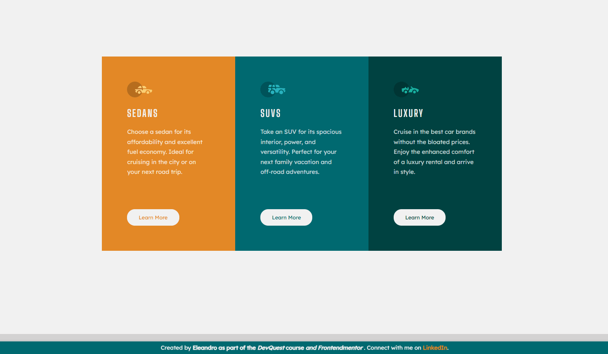
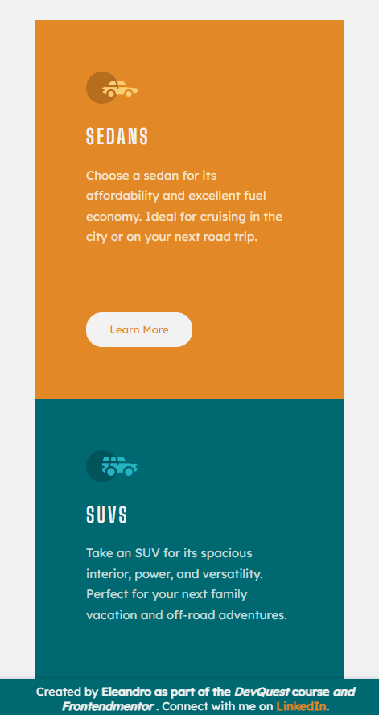

# 3-Column Preview Card Component Solution

This is a solution to the [3-column preview card component challenge on Frontend Mentor](https://www.frontendmentor.io/challenges/3column-preview-card-component-pH92eAR2-). Frontend Mentor challenges help you improve your coding skills by building realistic projects.

---

## 📋 Table of Contents

- [Overview](#overview)
  - [Preview](#preview)
  - [Links](#links)
- [My Process](#my-process)
  - [Languages and Tools](#languages-and-tools)
  - [What I Learned](#what-i-learned)
  - [Useful Resources](#useful-resources)
- [Author](#author)
- [Acknowledgments](#acknowledgments)

---

## Overview

### Preview

Here is a preview of the project:

#### Desktop Preview


#### Mobile Preview


[Click here to view the live site](https://eleandro.github.io/Column-Preview-Card-Component/)

---

### Links

- **Solution URL**: [GitHub Repository](https://github.com/Eleandro/Column-Preview-Card-Component)
- **Live Site URL**: [Live Site](https://eleandro.github.io/Column-Preview-Card-Component/)

---

## My Process

### Languages and Tools

- **HTML5**
- **CSS3**
- **Sublime Text 3**

### What I Learned

- **CSS Variables**: Reusing specific values throughout the document using custom CSS properties.

```css
:root {
	--cardone: hsl(31, 77%, 52%);
	--cardtwo: hsl(184, 100%, 22%);
	--cardthree: hsl(179, 100%, 13%);
	--paragraph: hsla(0, 0%, 100%, 0.75);
	--bg-h-btns: hsl(0, 0%, 95%);
	--heading-font: 'Big Shoulders Display', cursive, sans-serif;
	--paragraph-font: 'Lexend Deca', sans-serif;
}
```

- **Responsive Design**: Using `max-width` and `min-height` to make the parent container responsive and center the child div horizontally and vertically.

```css
.container {
	max-width: 100vw;
	min-height: 100vh;
	display: flex;
	justify-content: center;
	align-items: center;
}
```

- **CSS Grid**: Creating responsive cards without media queries.

```css
.cards {
	display: grid;
	grid-template-columns: repeat(auto-fit, minmax(300px, 1fr));
	gap: 20px;
}
```

- **Hover Effects**: Adding transitions and transforms to images for a smooth hover effect.

```css
img:hover {
	transform: scale(1.2);
	transition: 0.5s;
	cursor: pointer;
}
```

---

### Useful Resources

- [Frontend Trend](https://www.instagram.com/p/CeB5XMIjPyK/) - Helped me create responsive cards without media queries.

---

## Author

- **GitHub**: [Eleandro](https://github.com/Eleandro1302)
- **LinkedIn**: [Eleandro Mangrich](http://www.linkedin.com/in/eleandro-mangrich)

---

## Acknowledgments

I would like to thank:

- [Frontend Mentor](https://www.frontendmentor.io/) for providing this challenge.
- The **DevQuest** course for guiding me through this project.
- My mentor **Pablo** for his invaluable support and guidance throughout the course.

---

# Solução do Componente de Cartão de Pré-visualização em 3 Colunas

Esta é uma solução para o [desafio do componente de cartão de pré-visualização em 3 colunas no Frontend Mentor](https://www.frontendmentor.io/challenges/3column-preview-card-component-pH92eAR2-). Os desafios do Frontend Mentor ajudam você a melhorar suas habilidades de codificação construindo projetos realistas.

---

## 📋 Índice

- [Visão Geral](#visão-geral)
  - [Pré-visualização](#pré-visualização)
  - [Links](#links)
- [Meu Processo](#meu-processo)
  - [Linguagens e Ferramentas](#linguagens-e-ferramentas)
  - [O que Aprendi](#o-que-aprendi)
  - [Recursos Úteis](#recursos-úteis)
- [Autor](#autor)
- [Agradecimentos](#agradecimentos)

---

## Visão Geral

### Pré-visualização

Aqui está uma pré-visualização do projeto:

#### Pré-visualização Desktop


#### Pré-visualização Mobile


[Clique aqui para ver o site ao vivo](https://eleandro.github.io/Column-Preview-Card-Component/)

---

### Links

- **URL da Solução**: [Repositório no GitHub](https://github.com/Eleandro/Column-Preview-Card-Component)
- **URL do Site ao Vivo**: [Site ao Vivo](https://eleandro.github.io/Column-Preview-Card-Component/)

---

## Meu Processo

### Linguagens e Ferramentas

- **HTML5**
- **CSS3**
- **Sublime Text 3**

### O que Aprendi

- **Variáveis CSS**: Reutilizando valores específicos em todo o documento usando propriedades personalizadas do CSS.

```css
:root {
	--cardone: hsl(31, 77%, 52%);
	--cardtwo: hsl(184, 100%, 22%);
	--cardthree: hsl(179, 100%, 13%);
	--paragraph: hsla(0, 0%, 100%, 0.75);
	--bg-h-btns: hsl(0, 0%, 95%);
	--heading-font: 'Big Shoulders Display', cursive, sans-serif;
	--paragraph-font: 'Lexend Deca', sans-serif;
}
```

- **Design Responsivo**: Usando `max-width` e `min-height` para tornar o contêiner pai responsivo e centralizar o div filho horizontal e verticalmente.

```css
.container {
	max-width: 100vw;
	min-height: 100vh;
	display: flex;
	justify-content: center;
	align-items: center;
}
```

- **CSS Grid**: Criando cartões responsivos sem media queries.

```css
.cards {
	display: grid;
	grid-template-columns: repeat(auto-fit, minmax(300px, 1fr));
	gap: 20px;
}
```

- **Efeitos de Hover**: Adicionando transições e transformações às imagens para um efeito de hover suave.

```css
img:hover {
	transform: scale(1.2);
	transition: 0.5s;
	cursor: pointer;
}
```

---

### Recursos Úteis

- [Frontend Trend](https://www.instagram.com/p/CeB5XMIjPyK/) - Me ajudou a criar cartões responsivos sem media queries.

---

## Autor

- **GitHub**: [Eleandro](https://github.com/Eleandro1302)
- **LinkedIn**: [Eleandro Mangrich](http://www.linkedin.com/in/eleandro-mangrich)

---

## Agradecimentos

Gostaria de agradecer:

- [Frontend Mentor](https://www.frontendmentor.io/) por fornecer este desafio.
- O curso **DevQuest** por me guiar neste projeto.
- Meu mentor **Pablo** pelo suporte e orientação inestimáveis ao longo do curso.
